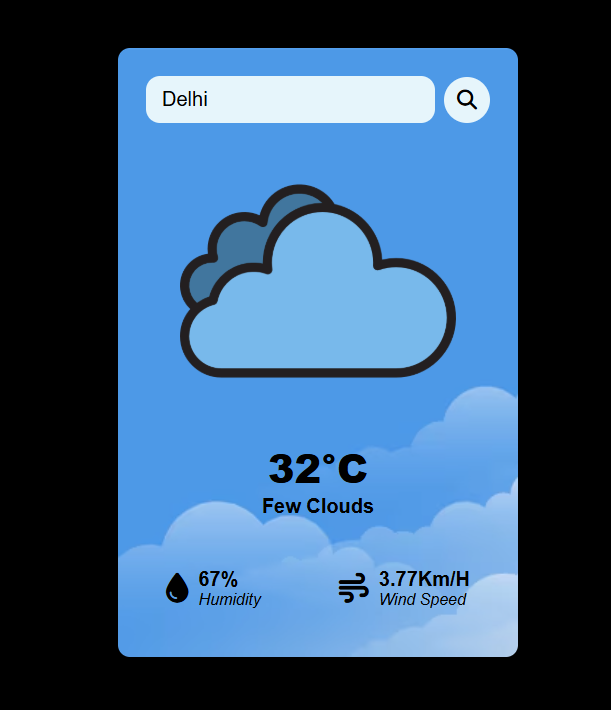

# Weather Forecast App

A simple weather forecast web app that displays real-time weather information for any city using the OpenWeatherMap API.

## 🌐 Features
- Search any city and get current weather
- Displays temperature, humidity, and wind speed
- Responsive and beginner-friendly design

## 🚀 Live Preview  
🔗 [Click here to try it out](https://irohit02.netlify.app/)

## 📸 Screenshot

## 🛠️ Tech Stack
HTML, CSS, JavaScript, OpenWeatherMap API

## 📂 How to Run
1. Clone the repo
2. Open `index.html` in browser

## 📄 License
This project is open-source under the [MIT License](LICENSE).

Website Link: https://irohit02.netlify.app/
